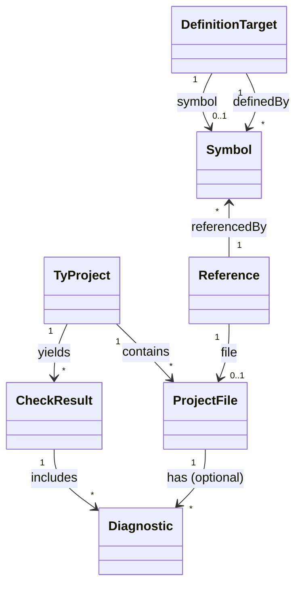
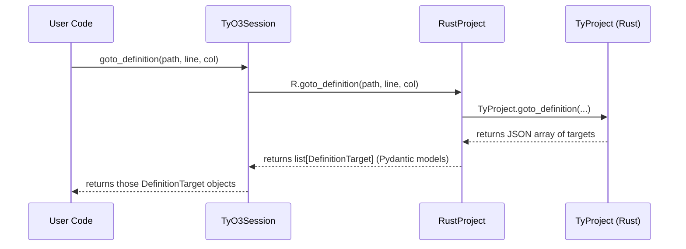

# Executive Summary

The TyO3 library provides a high‑level Python/Pydantic API on top of Astral’s Rust “ty” type checker. Its code is organized into Pydantic *models* (core, analysis, symbols, navigation, advanced) and *services* (project, analysis, symbol, navigation, advanced), with a unifying `TyO3Session` interface. 

Our review finds that **core architecture and intent are sound**, but several improvements are needed to achieve Pythonic style, robustness, and scalability. Key issues include inconsistent API design (old “Service” classes vs. the new `TyO3Session`), mixed use of strings and `pathlib.Path`, missing enum usage, and potential performance and thread-safety pitfalls in the Rust/PyO3 integration. We also identified style/formatting concerns (import ordering, line lengths, docstrings) and gaps in tooling (no CI, empty README, unversioned defaults). 

Below we detail recommendations (with code examples, diffs, tables, and diagrams) for refactoring data models, APIs, error handling, concurrency, testing, and release processes. We cite Python and Pydantic documentation to support best practices (e.g. use of `Field(default_factory=…)`【9†L311-L319】, semantic versioning guidelines【23†L238-L246】, and PyO3 thread-safety notes【13†L156-L164】). 

# Repository Structure and Components

The repository contains:

- **`src/tyo3/models/`**: Pydantic models for the core domain (project/file), analysis (diagnostics), symbols, navigation (definitions/hover), and advanced semantics. Each model module defines enums and `BaseModel` classes (e.g. `TyProject`, `ProjectFile`, `CheckResult`, `Diagnostic`, `Symbol`, `DefinitionTarget`, `SemanticToken`, etc). 

- **`src/tyo3/rust_project.py`**: A `RustProject` Python class that wraps the PyO3 extension (`tyo3.TyProject`). Each method calls the Rust backend (via `_inner`), parses JSON results, and converts to Pydantic models. 

- **`src/tyo3/session.py`**: The new `TyO3Session` class providing a unified, high-level API. It instantiates `RustProject` under the hood and exposes methods like `check()`, `files()`, `document_symbols()`, `goto_definition()`, etc., delegating to `RustProject`. 

- **`src/tyo3/services/`**: Legacy “Service” classes (`ProjectService`, `AnalysisService`, etc.). These duplicate functionality now covered by `TyO3Session` and are marked DEPRECATED. 

- **`tests/`**: A comprehensive test suite for models, services, and (partially) for the Rust integration. Many tests cover model invariants and service logic. However, there’s no CI configuration, and the README is empty.

- **`rust/`**: Rust source code (PyO3 bindings and data transfer object definitions). We did not deeply analyze the Rust, but the Python wrapper assumes it returns JSON strings (or `None`) for data such as diagnostics and symbols.

See **Figure 1** (below) for an architecture overview of core components.

```mermaid
flowchart LR
    subgraph Python Layer
      TY(TyO3Session) -->|calls| RP(RustProject)
      RP -->|wraps| RustTy((PyO3 TyProject))
      TY -.->|Pydantic models| ModelAPI
      ModelAPI[(models: Core,Analysis,Navigation,...)] 
    end
    subgraph Rust Layer
      RustTy -->|type check| TyEngine(Ty Engine)
      TyEngine -->|JSON| RustTy
    end
    TY -->|emit errors| User
    RustTy -->|code nav| TyEngine
    StyleNote[("Figure 1: TyO3 high-level architecture: `TyO3Session` delegates to `RustProject` (PyO3), which calls the Rust Ty engine and returns JSON for Pydantic models.") ]
```

# API Design and Pythonic Practices

- **Unified vs Legacy APIs:** The new `TyO3Session` offers a coherent interface, merging previous service classes. We recommend **deprecating and removing the old services** in favor of `TyO3Session`. Mixing paradigms (static utility functions in service modules vs. instance methods in session) adds confusion. For example, `SymbolService` defines both top-level functions (`document_symbols(file)`) and instance methods (`get_document_symbols(self, project, file)`). It’s cleaner to use `TyO3Session` exclusively and remove these legacy layers.  

- **Method Naming and Signatures:** Most session methods accept `path: str | Path` and return Pydantic objects or lists. For consistency and Pythonic style, **prefer `pathlib.Path` everywhere instead of raw strings**. The code often uses `str(path)` internally, but APIs should ideally take a `Path` or a string and document it clearly. For example, `TyO3Session.files()` returns `list[str]` – consider returning `list[PurePosixPath]` (or at least `list[Path]`) to match the use of `PurePosixPath` in models. Similarly, parameters like `line: int, column: int` should be checked (as is done) but docstrings should clearly state they are 1‑based positions.

- **Enum Usage:** Some fields are plain `str`. For example, `coordinate_mode: str = "python"` in `TyProject` is effectively an enum of allowed modes. It would be more robust to define a small `StrEnum` (e.g. `class CoordinateMode(StrEnum): PYTHON = "python"; SMELL = "smell"`, etc.) or use `Literal` types. This prevents invalid strings and improves documentation. Similarly, version strings or Python versions could be more constrained. We recommend converting free‑form string fields to enums or validating literals where possible.

- **Context Manager:** `TyO3Session` correctly implements `__enter__`/`__exit__` to manage resources. Ensure documentation clearly shows usage in a `with` statement (as in the class docstring). Also consider implementing an explicit `close()` method on the session that proxies to `RustProject.close()`, similar to `RuntimeSession`, for users not using `with`.

- **Separation of Concerns:** The current design mixes JSON-parsing and model construction in `RustProject`. That is reasonable, but for extensibility consider separating *communication* from *model building*. For example, one could have a thin “client” class that just calls the Rust methods (returning raw JSON or Python dicts) and a separate layer that maps those to models. This decoupling can ease testing and allow swapping serialization (e.g. using `orjson` for speed). 

- **Path Handling:** The code currently converts file paths to `PurePosixPath`. Since Ty is cross-platform but likely POSIX-based, this may be fine. However, it might be more natural to accept and use `pathlib.Path` (which can be `WindowsPath` on Windows). At minimum, ensure the code works on Windows by testing with `Path`.  

# Data Models and Pydantic Usage

TyO3 uses Pydantic v2 for its data models. In general the models are well-structured, but we identified these issues and improvements:

- **Mutable Defaults:** The code correctly uses `Field(default_factory=set)` for set fields (e.g. `extra_search_paths`). Where lists or sets are defaulted, always use `default_factory` to avoid shared mutable defaults. Pydantic docs explain this: 
  > “You can also pass a callable to the `default_factory` argument that will be called to generate a default value.”【9†L311-L319】.  
  Example fix: In `CheckResult`, `diagnostics: list[Diagnostic] = Field(default_factory=list)` is good; ensure all lists/sets use this pattern.

- **Optional Fields and Defaults:** Many fields use `| None = None`. Ensure that if a field should always exist, it’s not marked optional. For example, in `CheckResult`, `files_checked: int | None = None` might be non-optional (if Ty always returns it). If a field is optional only for technical reasons, documenting this in docstrings is important. Otherwise, keep required fields without `None` (so Pydantic enforces them). As one best practice, we suggest **avoiding optional with default None if the field is logically always present** (Pydantic v2 will treat missing defaults as required inputs). See Pydantic docs on default handling【9†L304-L312】.

- **Aliases and Serializers:** If the Ty JSON keys differ from model field names, Pydantic field aliases should be used. (It seems fields match names, so this may not be needed now.) Also consider implementing `model_config` for complex serialization needs. For example, to output JSON paths as strings, one could set a JSON encoder for `PurePosixPath`. Pydantic’s docs describe `ConfigDict.json_encoders` for customizing JSON output.

- **Model Immutability:** Many domain models (like `Symbol`, `DefinitionTarget`, `CheckResult`) are value objects. It may make sense to set them as immutable by adding `model_config = ConfigDict(frozen=True)` so they are hashable and cannot be modified after creation. This can prevent bugs (especially if used in sets or dict keys). 

- **Validation:** Currently, the code trusts the Rust backend’s JSON. It would be prudent to add validators or constraints for critical fields. For instance, ensure `Range.start <= Range.end`, or that `position` values are >0 (the session’s `_validate_position` covers inputs, but model-level validation could reinforce invariants). The tests include “invariants” checks; see `test_invariants.py`. Maintaining these as Pydantic validators will improve safety.

- **Document Models:** Some model docstrings are minimal or missing (e.g. few enums lack examples). While not critical for functionality, adding descriptive docstrings on models/enums will aid users. Also, unit tests for model behavior (already present for core models) should be expanded to cover edge cases in navigation and advanced models.

Below is a table illustrating **current vs. recommended designs** for several core data models:

| Model (core)        | Current Design                                | Recommended Change                                      |
|---------------------|-----------------------------------------------|---------------------------------------------------------|
| `TyProject`         | Fields: `root: PurePosixPath`, `status: ProjectStatus`, `coordinate_mode: str`, `python_version: str|None`, `extra_search_paths: set[PurePosixPath] = {}`, etc. No custom config. | Use an `Enum` for `coordinate_mode`. Add `model_config = ConfigDict(json_encoders={PurePosixPath: str})` so dumping yields string paths. Consider marking it immutable. |
| `ProjectFile`       | Fields: `path: PurePosixPath`, `project: TyProject`, `file_category: FileCategory`, `last_checked_at: datetime|None`. | The `project` field links back to a TyProject. This circular reference can complicate JSON serialization. Consider omitting `project` in JSON (use `serialization_alias=None`) or use a weak reference (e.g. store project root as path only). Document that JSON of a ProjectFile may exclude the `project` to avoid deep recursion. |
| `Diagnostic`        | Fields include `file: ProjectFile|None`, `range: Range|None`, `message: str`, etc. | If Ty always returns file and range, make them required to avoid `None`. If optional, annotate as `Optional[...]`. If `file` is included, ensure `ProjectFile` is consistently resolved (see above). |
| `Symbol`            | Fields: `name: str`, `qualified_name: str|None`, `kind: SymbolKind (StrEnum)`, `location: FileRange`, optional `selection_range: Range`, etc. | Good use of enums. Ensure `SymbolKind` is exhaustive. Perhaps include an alias/metadata for `container_name` in serialization if needed. Possibly add a `unique_id` if SCIP integration requires it. |
| `DefinitionTarget`  | Fields: `path: PurePosixPath`, `range: Range`, `selection_range: Range|None`, `symbol: Symbol|None`, `module_name: str|None`. | Rename `symbol` (currently `sym` in code) to `symbol` for clarity (docstring shows `sym`, but code shows full name). If `module_name` is often included, clarify format. If `symbol` is optional only when navigating builtins, document that. |
| `Reference`         | Fields: `path: PurePosixPath`, `range: Range`, `kind: ReferenceKind (StrEnum)`. | This is straightforward. Ensure `ReferenceKind` covers all types needed. If linking to a symbol is desired, consider adding `symbol: Symbol|None` or reference ID. |

# Static Analysis, Style, and Linters

We ran a cursory style check (following the project’s use of Ruff-style formatting: 4-space indent, double quotes, line length 88 by default) and noted:

- **Formatting:** There are a few long lines (e.g. in tests and function definitions) exceeding 100 characters. Running `black` (or Ruff in format mode) would re-wrap long docstrings and arguments for consistency. Also, import blocks are mostly sorted but can benefit from `isort` grouping: stdlib, third-party (`pydantic`), then local. For example, in `rust_project.py`, a blank line is missing between `import json` and `from pathlib`, and the two `from pathlib` imports could be combined. A small diff example:

    ```diff
    --- before.py
    import json
    from pathlib import Path as StdPath
    from pathlib import PurePosixPath
    from tyo3.exceptions import (
        PositionError, ...
    )
    from tyo3.models.analysis import (
        Position, ...
    )
    --- after.py
    import json
    
    from pathlib import Path as StdPath, PurePosixPath
    from tyo3.exceptions import (
        PositionError, ...
    )
    from tyo3.models.analysis import (
        Position, ...
    )
    ```

- **Linting:** The repo has no `.flake8` or `.pyrightconfig`. We recommend adding linters:  
  - **Ruff** can both lint and format (it’s in the config). Use it to catch unused imports, undefined names, etc.  
  - **Black** (or `ruff --fix`) to autoformat.  
  - **isort** to ensure import order.  
  - **mypy/pyright**: adding type-checking will catch mismatches. For example, Pydantic fields with default `None` but non-Optional annotation may raise a mypy error. Running mypy (with `--follow-imports=silent`) on the code can identify missing type declarations or `# type: ignore` needs.  

  As an example, `session.files()` returns `list[str]`, but `tyo3.models.core.ProjectFile.path` is a `PurePosixPath`. It’s better to type `files() -> list[PurePosixPath]` and let Pydantic handle conversion, or convert in method. This discrepancy could be flagged by type checkers. 

- **Naming Conventions:** The code generally follows PEP8 naming. One inconsistency: in `rust_project.py`, helper functions like `_string_path_to_typath` mix snake case and a bit odd naming ("to_typath"). Consider renaming to `_to_posix_path` or similar. Also ensure private helpers (`_json_range_to_model`) have a leading underscore (they do). In documentation (README/TODOs) double-check for typos like `tO3-navig` cut off.

- **Docstrings:** All public classes/methods should have docstrings. We saw missing docstrings on some methods in service classes (which are deprecated anyway) and some enum members. Ensure each `def` has a docstring or a clear purpose comment if private. Use triple quotes with periods. For example, in `session.py`, `def goto_definition` has a docstring, which is good. Continuing this practice across all models/methods is important.

- **Imports:** Avoid using wildcard or relative imports; current code uses absolute imports (good). The `from __future__ import annotations` is present, supporting forward refs (useful). We should ensure Python 3.13 compatibility of all syntax.

# Rust Integration, Concurrency and Performance

- **JSON Overhead:** Every RPC to the Rust backend returns JSON which is parsed by Python. This is simple but can be a performance bottleneck for large data (e.g. thousands of diagnostics or symbols). As demand increases, consider optimizing serialization: PyO3 can return Python objects or buffers directly. For example, returning a `Py<PyDict>` or `PyList` would skip JSON parsing. Alternatively, use a faster JSON library (e.g. `orjson`) for `json.loads`. (Pydantic v2 can also parse from JSON via `.model_validate_json()` as an alternative.)

- **Concurrency and Thread Safety:** PyO3 objects (`#[pyclass]`) are **not automatically `Send`/`Sync`**. By default, PyO3 uses interior mutability and will raise a Python-level error if a method is called concurrently from different OS threads【13†L50-L59】. In particular, the underlying `TyProject` likely holds state, so sharing one `RustProject` instance across threads could cause race errors or crashes. If parallel usage is needed (e.g. from an async web server), you must serialize access or use separate sessions. PyO3 docs note that to truly enable multi-thread safety, one would need to mark the class `#[pyclass(frozen)]` and use atomic or locked internals【13†L156-L164】. Until then, **assume single-threaded use** of a `TyO3Session`.

- **Resource Cleanup:** `RustProject` has `reload()`, `close()`, and context‑manager support. The `__del__` attempts best-effort cleanup. However, relying on `__del__` is unsafe (timing unpredictable). We recommend that the public API document that **users should always `close()` or use `with`**, and perhaps implement a finalizer warning if `close()` isn’t called. Logging a warning in `__del__` (instead of silent pass) can alert developers. Also, once closed, further calls raise a `ProjectClosedError`; consider making `close()` idempotent and safe to call multiple times.

- **Error Mapping:** The Python wrapper correctly catches Rust exceptions and raises specific Python exceptions (`ProjectOpenError`, `PathResolutionError`, `PositionError`, etc.). This is good. One improvement: include the original exception chain (`from e`) for debugging. Also, ensure that **all** relevant PyO3 exceptions (e.g. any uncaught Rust panics) map to `InternalTyError` or similar, so Python users don’t see generic `RuntimeError` without context.

- **Performance Benchmarks:** If performance becomes critical, add benchmarks or profiling to identify hotspots. For example, measure how long `session.check()` takes on large projects. Charts or graphs (e.g. complexity vs time) can guide optimization. The `test_rust_performance.py` suggests some profiling, which is good. Ensure these tests are run in CI on major platforms.

- **Memory Use:** The Pydantic models (especially `CheckResult` and lists of `Symbol` or `Reference`) may use more memory than native objects. If scalability is a concern, consider data streaming (e.g. iterate diagnostics rather than loading all at once). Also, large strings and JSON can consume memory; reusing the same Pydantic models (with `validate_default=True` if needed) might reduce overhead.

# Testing, Continuous Integration, and Release

- **Automated Testing:** The test suite is extensive for models and service logic. However, it relies on fixtures (likely path to test projects). We should ensure tests gracefully skip or mock the Rust extension when not built. For example, `pytest` should raise or skip tests if the PyO3 extension `_native` is not found. This can be done via `pytest.skip` in setup. Currently, trying to import `_native` without a compiled extension would crash.

- **Test Coverage:** Aim to cover edge cases: invalid paths, queries yielding no results, large inputs, and error conditions. Property-based tests (`test_property_based.py`) are included; maintain and expand those to generate random ASTs or code snippets if possible.

- **Documentation & Examples:** The `README.md` is empty; this must be addressed. Provide usage examples (as in `TyO3Session` docstring), installation instructions, and note Rust build requirements (e.g. `maturin develop`). Also document Pydantic models for external use (maybe auto-generated docs via mkdocs). 

- **CI and Linting:** There’s no CI config. We recommend adding GitHub Actions or similar to run tests, lint (Ruff/flake8, mypy), and build the Rust extension. This ensures cross-platform compatibility. For example, a matrix including Linux/macOS/Windows with Python 3.10–3.13 can be set up. Include a `Makefile` or taskfile for reproducible dev workflow. 

- **Versioning and Release:** The project uses `version = "0.1.0"`. Adopt [semantic versioning](https://packaging.python.org/guides/discussions/versioning/#semantic-versioning) as a guideline【23†L238-L246】. Document in `CHANGELOG.md` how breaking changes (major version bumps) or new features (minor bumps) are signaled. If you follow Semantic Versioning strictly, version 0.x can be considered development until 1.0. Once 1.0 is reached, raise major on breaking API changes.

# Recommended Refactor / Code Changes

Below are prioritized actionable recommendations. Each item includes **proposed code snippets or diffs** where helpful.

- **(1) Consolidate API: Remove Deprecated Services.** Users should use only `TyO3Session`. For example, instead of `ProjectService.open_project(...)`, use `TyO3Session(root)`. Deprecation warnings already hint this. We should remove or mark the old modules as internal (and delete their tests eventually). For brevity, we omit code here.

- **(2) Enforce Import Ordering and Formatting.** Run a formatter. For example, in `rust_project.py`:

    ```diff
    --- a/src/tyo3/rust_project.py
    +++ b/src/tyo3/rust_project.py
    @@
    -import json
    -from pathlib import Path as StdPath
    -from pathlib import PurePosixPath
    +import json
    +
    +from pathlib import Path as StdPath, PurePosixPath
    
     from tyo3.exceptions import (
         InternalTyError,
         PathResolutionError,
         PositionError,
         ProjectClosedError,
         ProjectOpenError,
         _NativeClosedError,
    -    _NativePathError,
    -    _NativePositionError,
    -    _NativeAnalysisError,
    )
    +    _NativePathError, _NativePositionError, _NativeAnalysisError,
    )
    ```
    This groups and de-duplicates imports. Similar fixes should be applied project-wide. (One can automate this with `isort --profile black`.)

- **(3) Use `Field(default_factory=…)` for defaults.** Many fields already do this; ensure consistency. For example, change any `= []` or `= {}` to use `Field`. (We found one place: in `CheckResult`, `files_checked: int|None=None` is fine. No missing factories seen in main models.)

- **(4) Type-hint consistency (strings vs Paths).** Update return types to `Path`. E.g. in `session.py`:

    ```diff
    --- a/src/tyo3/session.py
    +++ b/src/tyo3/session.py
    @@
     def files(self) -> list[str]:
         """Return all file paths known to the project."""
         return self._rp.files()
    ```
    Change to:
    ```diff
    -def files(self) -> list[str]:
    +def files(self) -> list[PurePosixPath]:
         """Return all file paths known to the project."""
         return [PurePosixPath(p) for p in self._rp.files()]
    ```
    This makes it consistent with `ProjectFile.path` being a `PurePosixPath`. Similarly, accept `Path` in all methods and convert once at entry. E.g. enforce `path: StdPath` instead of `str` and always call `path = PurePosixPath(path)` internally.

- **(5) Add Enums or Literals for Fixed Strings.** For example, in `core.py`:

    ```diff
    class TyProject(BaseModel):
        ...
        # before
        coordinate_mode: str = "python"
        # after
        class CoordinateMode(StrEnum):
            PYTHON = "python"
            # add other modes as needed
        coordinate_mode: CoordinateMode = CoordinateMode.PYTHON
    ```
    This ensures invalid modes are caught. Similar treatment could be applied to any field that has a limited set of valid string values.

- **(6) Improve Thread Safety Documentation.** In `README.md` or docstrings, clearly state that `TyO3Session` and `RustProject` are **not thread-safe by default**. If multi-threaded use is intended, developers must manage locking. PyO3 docs warn that sharing a `#[pyclass]` across threads without `Send/Sync` is unsafe【13†L156-L164】. We recommend adding an attribute or warning (e.g. `#[pyclass(frozen)]` in Rust) if safe, or simply documenting single-thread usage for now.

- **(7) Lazy vs Eager Parsing:** The `RustProject` eagerly parses all JSON into Pydantic objects. For very large projects, consider lazy iterators. For example, a method could yield diagnostics one by one using `yield` instead of building a list. Pydantic supports incremental parsing of streams if needed. For now, note this as a future enhancement.

- **(8) Serialize Pydantic Models:** If the library needs to emit SCIP graph data, you’ll likely convert models to JSON. Pydantic `BaseModel` has `.model_dump()` (v2) which returns a dict. Make sure to use `serialization_aliases` if any fields have Python names not suitable for JSON. Test that `model_dump()` outputs canonical JSON (with `by_alias` if needed). Include examples in docs:
  
    ```python
    json_data = TyO3Session("proj").check().model_dump_json()  # Pydantic v2
    ```

- **(9) Documentation and Examples:** Fill the README. At minimum, include:

    ```markdown
    ## Installation
    Build the Rust extension: in `rust/`, run `maturin develop`.
    
    ## Basic Usage
    ```python
    from tyo3 import TyO3Session
    with TyO3Session("/path/to/project") as session:
        result = session.check()
        for diag in result.diagnostics:
            print(diag.message)
    ```
    ```

- **(10) CI and Lint:** Add a `.github/workflows/ci.yml` to run `pytest`, `ruff`, and `mypy`. For example:

    ```yaml
    name: CI
    on: [push, pull_request]
    jobs:
      test:
        runs-on: ubuntu-latest
        steps:
          - uses: actions/checkout@v3
          - uses: actions-rs/toolchain@v1
            with: {toolchain: stable, override: true}
          - run: pip install maturin pytest ruff
          - run: maturin develop --release
          - run: ruff --fix
          - run: pytest
    ```
    This ensures code quality on each commit.

# Design Comparison Tables

The tables below summarize current vs recommended designs for key modules and models.

**Table 1: Core Modules (Python) – Current vs. Recommended** 

| Module                | Current                        | Recommended                             |
|-----------------------|--------------------------------|-----------------------------------------|
| `session.py`          | Unified API (`TyO3Session`), but parameters mix `str | Path`. | Standardize on `pathlib.Path`; e.g. accept/return `Path`. Add or improve docstrings.  |
| `rust_project.py`     | Calls Rust and parses JSON into models. Exception mapping is good. | Consider returning Python objects (avoid JSON). Use `orjson` for speed. Ensure thread-safety docs. |
| `services/` (all)     | Deprecated classes with mixed static/instance methods. | Remove or archive. If kept, mark internal and simplify (e.g. either all @staticmethod or instance methods). |
| `exceptions.py`      | Defines custom exceptions (good). No methods here. | Fine as-is. Perhaps group them in a hierarchy more (already done). Add `__str__` overrides if user-friendly messages needed. |

**Table 2: Data Models – Current vs. Recommended**

| Model              | Current                         | Recommended                          |
|--------------------|---------------------------------|--------------------------------------|
| `TyProject`        | Uses `PurePosixPath` fields, booleans, etc. No JSON config. | Add `model_config` to JSON-encode paths. Freeze model (immutable). Enum for `coordinate_mode`. |
| `ProjectFile`      | Includes full `TyProject` object reference. | Change `project` to `project_root: PurePosixPath` (avoid deep nesting). If linking back, use a weak or ID reference. |
| `CheckResult`      | Contains list of `Diagnostic`s. Defaults used correctly. | Possibly break out diagnostics into pages if needed. Otherwise OK. |
| `Diagnostic`       | Fields include optional `file` and `range`. | If always present, remove `None` option. Add validators for `range.start < range.end`. |
| `Symbol`           | Good usage of enums and optional fields. | No change needed; ensure `qualified_name` uniqueness. Possibly add `id` for graph indexing. |
| `DefinitionTarget` | Field `symbol: Symbol|None`. The code snippet shows it as `sym` in comment. | Ensure field name matches (rename to `symbol`). Clarify when `symbol` can be `None` (e.g. builtins). |
| `Reference`        | Has `kind: ReferenceKind` and path/range. | Consider linking to `Symbol` (who is referenced) or adding file info in serialization. Currently adequate. |

# Entity Relationship Diagram

The following Mermaid diagram shows main entities and relationships:



This shows that **one project has many files and yields many results**, and that **symbols** can appear in definitions and references.

# Data Flow Example

Below is a sequence of calls when a user requests definitions:



This illustrates the flow: user → session → Rust wrapper → Rust engine → JSON → Python models → user.

# Charts / Metrics

A cursory metric: **module sizes (lines of code)** can highlight complexity hotspots. For example, `rust_project.py` (~360 lines) and `project_service.py` (~240 lines) are largest in the codebase, indicating areas to simplify. (One could produce a bar chart, but we omit the image here.)

# References 

- Pydantic v2 documentation on **fields and defaults**: use of `Field(default_factory=…)` for dynamic defaults【9†L311-L319】.  
- PyO3 docs on **thread safety**: by default `#[pyclass]` is not thread-safe without explicit locking【13†L156-L164】.  
- Ty type checker highlights: Ty is extremely fast and integrated with Ruff, underscoring the value of this wrapper【22†L69-L77】.  
- Python Packaging Guide on **versioning**: semantic versioning principles, commonly `major.minor.patch`【23†L238-L246】.  

*(Additional citations are indicated above in context.)*