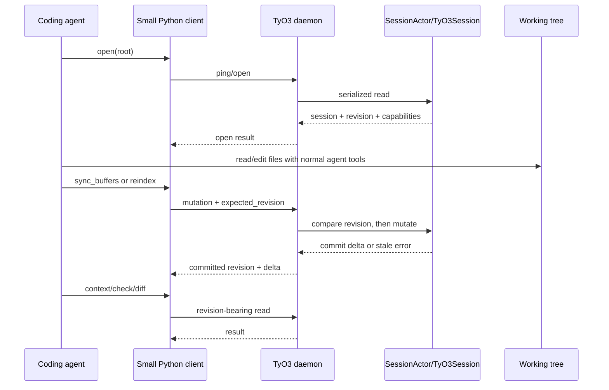

# Project 32 — agent-only MVP investigation

**Date:** 2026-09-14  
**Status:** MVP decision recorded; implementation not started  
**Scope:** the smallest useful external agent interaction with a live TyO3 project, without Neovim

## Classification

This report uses the following labels:

- **[Verified fact]** — established by current source or an existing test, with an anchor.
- **[Measured result]** — established by a repeatable repository command.
- **[Inference]** — conclusion drawn from the evidence; not a current invariant.
- **[Recommendation]** — proposed MVP behavior or implementation boundary.
- **[Unresolved question]** — deliberately left for a later product decision.

## Executive decision

**[Inference]** The original broad control-plane proposal was larger than the
problem we need to solve first. TyO3 already has enough semantic machinery for
an external agent to work without Neovim: a daemon, a serialized session actor,
durable IDs, diagnostics, context/symbol/navigation queries, atomic multi-file
overlay edits, authored writes, and a revision-bearing native engine.

**[Recommendation]** The MVP is one small headless Python client over the
existing daemon, plus three protocol hardenings:

1. Add a compact capabilities manifest to `ping` or `open`.
2. Include the observed revision in the MVP read results.
3. Add optional `expected_revision` to `sync_buffers` and `author`, checked
   inside the serialized actor operation.

**[Recommendation]** The MVP agent loop is:

```text
connect/start daemon
    → open/ping
    → read context, symbols, navigation, diagnostics
    → edit the working tree with the agent's normal file tools
    → tell TyO3 about the changed text, or reindex the changed files
    → check and inspect the resulting revision/diff
```

**[Recommendation]** This is a headless mode, not a new semantic architecture.
Keep the existing daemon, `SessionActor`, `TyO3Session`, native snapshots,
native staged commit, Python graph projection, and bus. Do not add a
`SemanticState`, server-side snapshot service, replay log, MCP server, or
filesystem writer in the MVP.

**[Verified fact]** The previous broad report is preserved in the immediately
preceding published history point. This document intentionally replaces its
roadmap with the narrower MVP decision; the earlier evidence remains available
through repository history.

## The concrete problem

**[Recommendation]** An external coding agent should be able to use TyO3 as a
headless semantic companion while it edits a working tree. It should not need
Neovim, an editor plugin, or direct access to Python internals.

**[Inference]** “Effective” for the first version means the agent can answer
four questions in a tight loop:

1. What project/session am I connected to?
2. What does this code/entity mean at the revision I just observed?
3. Did my edit reach TyO3, and did it introduce diagnostics or semantic changes?
4. Did another write make my intended mutation stale?

**[Recommendation]** The MVP does not need to answer every possible graph,
history, provenance, or event-replay question. It needs a reliable inspect →
edit → synchronize → check loop.

## What already exists

| Need | Current capability | Evidence | MVP disposition |
|---|---|---|---|
| Project discovery and open | **[Verified fact]** Daemon is launched per root, owns one `TyO3Session`, takes a per-root lock, opens the project, and runs initial synchronization. | `src/tyo3/daemon/server.py:46-95`, `:191-294`; `src/tyo3/daemon/session_actor.py:1-139` | Reuse. |
| Transport | **[Verified fact]** Newline-delimited JSON-RPC 2.0 over a Unix socket with request IDs and notifications. | `src/tyo3/daemon/protocol.py:1-151` | Reuse. |
| Basic discovery | **[Verified fact]** `ping` returns root, session ID, current revision, and method names; `open` returns root, revision, files, precision, and layers. | `src/tyo3/daemon/handlers.py:71-100` | Add a small capabilities field. |
| Semantic context | **[Verified fact]** `context_pack` returns durable ID, source, references, authored layers, and optional reference bodies. | `src/tyo3/daemon/handlers.py:706-725` | Reuse as the primary agent context call. |
| Symbols/navigation | **[Verified fact]** Daemon exposes `symbols`, `references`, `definition`, `hover`, `document_highlights`, `type_hierarchy`, and `call_hierarchy`. | `src/tyo3/daemon/handlers.py:326-529` | Reuse the existing bounded subset. |
| Diagnostics | **[Verified fact]** `check` and `diagnostics_at` are callable daemon operations. | `src/tyo3/daemon/handlers.py:306-317`, `:583-606` | Add observed revision to responses. |
| Durable identity | **[Verified fact]** Native identity reconciliation and `id_for`/`locate` are already used by the Python and daemon surfaces. | `rust/src/project/methods.rs:681-716`; `src/tyo3/daemon/handlers.py:138-157`, `:233-241` | Reuse durable IDs; no new identity layer. |
| Multi-file action | **[Verified fact]** `sync_buffers` calls native `edit_many`, which stages multiple files as one commit/revision. | `src/tyo3/daemon/handlers.py:115-136`; `rust/src/project/methods.rs:225-260` | Reuse, with stale-write guard. |
| Authored action | **[Verified fact]** `author` writes a JSON value to a registered authored layer and persists it through the native commit path. | `src/tyo3/daemon/handlers.py:202-214`; `rust/src/project/methods.rs:303-334` | Reuse, with stale-write guard. |
| Verification after edit | **[Verified fact]** `diff` accepts explicit revisions and returns code ID changes/moves; `ping` exposes current revision. | `src/tyo3/daemon/handlers.py:243-269`, `:71-84` | Reuse for post-write verification. |
| Atomicity/rollback | **[Verified fact]** Native staged commits publish the revision last and restore baseline state on failure. | `rust/src/project/commit.rs:446-485`, `:521-577`, `:876-1035`; `tests/test_final_transaction_rollback.py` | Preserve; do not duplicate in Python. |
| Headless testing | **[Verified fact]** Real daemon subprocess/socket tests already exercise ping, open, queries, sync, notifications, multiple clients, and slow dispatch. | `tests/daemon/test_end_to_end.py:181-347` | Extend with the MVP loop. |

**[Measured result]** The current daemon advertises 31 methods. The method
table is broad enough for the MVP but is not itself a machine-readable client
contract. The repeatable measurement is:

```text
SECRETSPEC_REASON="Project 32 measure daemon method table" devenv shell -- \
  python -c 'from types import SimpleNamespace; from tyo3.daemon.handlers import Handlers; h=Handlers(SimpleNamespace(root=".")); print(len(h.methods)); print(",".join(h.methods))'
```

## The MVP boundary

### External boundary

**[Recommendation]** The external agent boundary is the existing daemon socket,
accessed through a small Python client. The client should hide JSON framing,
request IDs, connection setup, and response decoding, but it should not invent
a second semantic model.

**[Recommendation]** The client needs only these high-level operations in its
first release:

| Client operation | Daemon route(s) | Purpose |
|---|---|---|
| `open()` / `status()` | `ping`, `open` | Establish root, session ID, revision, and capabilities. |
| `context(path, line, column)` | `context_pack`, optionally `entity_at` | Get the durable entity and local semantic context. |
| `search(query)` | `symbols` | Find candidate symbols without understanding graph internals. |
| `navigate(...)` | `definition`, `references`, `hover`, hierarchy routes | Inspect relationships around an entity. |
| `check(path?)` | `check`, `diagnostics_at` | Validate the current semantic state. |
| `sync_buffers(edits, expected_revision?)` | `sync_buffers` | Send an intentional in-memory semantic overlay update. |
| `author(layer, id, value, expected_revision?)` | `author` | Write an authored annotation when explicitly requested. |
| `diff(from_revision, to_revision?)` | `diff` | Verify what changed after a write. |

**[Recommendation]** The client may expose `subscribe` as an optional
optimization, but polling `status()`/`ping` after an action is the MVP
correctness mechanism. A client must not depend on notifications for recovery.

### Internal boundary

**[Verified fact]** The daemon's `SessionActor` already serializes all session
calls on a dedicated thread, while the native project serializes mutable state
behind its project mutex (`src/tyo3/daemon/session_actor.py:1-139`;
`rust/src/project.rs:226-279`).

**[Recommendation]** Keep that as the internal control boundary. The new client
and small handler changes should call the existing session/native operations;
they should not coordinate identity, code-layer, authored, or derived state
independently.

**[Verified fact]** Project 31 established that the identity registry and
current code layer have different lifetimes, key populations, production order,
and persistence, and current `HeadState` keeps them separate
(`rust/src/project.rs:70-169`; `.scratch/projects/31-semantic-state/INVESTIGATION.md`).

**[Recommendation]** The MVP must preserve this decision. Session/revision
metadata belongs to the daemon protocol; it is not a reason to introduce a
semantic-state wrapper.

## Minimal protocol changes

### 1. Capabilities in `ping` or `open`

**[Verified fact]** Current discovery returns method names but no concise
description of which operations are safe reads, overlay writes, authored
writes, or notification optimizations (`src/tyo3/daemon/handlers.py:71-100`).

**[Recommendation]** Add a stable protocol marker and a small capabilities
object, for example:

```json
{
  "protocol_version": 1,
  "session_id": "...",
  "root": "/project",
  "revision": 42,
  "capabilities": {
    "reads": ["context_pack", "symbols", "definition", "references", "check", "diff"],
    "mutations": ["sync_buffers", "author"],
    "notifications": ["delta", "refinement", "derived"],
    "limits": {"symbols_max": 500}
  }
}
```

**[Recommendation]** This is a manifest, not a full schema registry or
negotiation framework. The client can reject an unsupported protocol version
and degrade gracefully when an optional capability is absent.

### 2. Revision-bearing MVP reads

**[Verified fact]** Current handlers often create a snapshot internally but
omit the revision from the response. This applies to `symbols`, navigation,
checks, and several identity routes (`src/tyo3/daemon/handlers.py:138-157`,
`:306-454`, `:415-529`).

**[Recommendation]** Add `revision` to the responses used by the MVP:
`context_pack`, `entity_at`, `symbols`, `definition`, `references`, `hover`,
`check`, and `diagnostics_at`. Preserve the existing payload fields.

**[Recommendation]** The revision means “the native/session revision observed
for this result.” It does not claim that every separate call in a sequence
shares that revision. A future snapshot handle can solve multi-call pinning;
the MVP uses one composite context call where consistency matters.

### 3. Stale-write protection

**[Verified fact]** Native `edit_many` and `author` are atomic once invoked, but
the current daemon has no expected-revision check and no idempotency key
(`src/tyo3/daemon/handlers.py:115-136`, `:202-214`).

**[Recommendation]** Accept an optional `expected_revision` on `sync_buffers`
and `author`. The handler must read the current revision and compare it inside
the same actor work item immediately before mutation. If it differs, return a
typed stale-revision error and do not call the native mutation.

**[Inference]** Checking inside one actor work item is sufficient for the MVP:
no other daemon request can interleave between the check and the session call.
This does not claim that direct, independently created Python sessions are
covered.

**[Recommendation]** On success, return the existing full commit delta plus
`base_revision` and `committed_revision`. On stale failure, return current
revision and no commit delta.

### 4. Small headless client

**[Recommendation]** Add a minimal Python client/library or CLI that provides
the high-level operations above. It should be usable from an external coding
agent without importing private daemon/session classes.

**[Recommendation]** The client should implement:

- daemon start/connect and socket cleanup;
- newline JSON-RPC framing and request correlation;
- capability parsing;
- typed stale/closed/evicted/engine errors;
- simple synchronous calls suitable for an agent tool wrapper;
- post-mutation `status` and `diff` helpers.

**[Recommendation]** Do not add MCP in this project. An MCP adapter can later
call this client if a tool-discovery integration is desired.

## Agent-only interaction sequence

**[Verified fact]** Neovim currently supplies buffer synchronization and applies
workspace edits, but the daemon itself does not require Neovim
(`editors/tyo3.nvim/lua/tyo3/daemon.lua:1-250`; `src/tyo3/daemon/__init__.py:1-28`).

**[Recommendation]** The intended MVP sequence is:



**[Recommendation]** The agent can use the filesystem directly for durable
source edits. `sync_buffers` remains an explicit semantic-overlay operation.
The MVP must document this distinction rather than silently turning TyO3 into
a filesystem owner.

## Filesystem and mutation semantics

**[Verified fact]** Native `edit`/`edit_many` update an in-memory overlay;
`edit_virtual` handles virtual URIs; `sync_path`, `discard`, and `sync_all`
reconcile with disk (`rust/src/project/methods.rs:184-426`).

**[Recommendation]** MVP supports two explicit modes:

1. **Working-tree mode:** the agent writes files with its normal file tools,
   then asks TyO3 to reindex/synchronize them. TyO3 provides semantic feedback;
   the agent owns filesystem persistence.
2. **Overlay mode:** the agent sends `sync_buffers` when it intentionally wants
   TyO3 to analyze unsaved text. The response confirms a semantic revision, not
   a disk write.

**[Unresolved question]** The exact daemon route for “re-read these already
written files” may be `reindex` for MVP or a narrower future `sync_path` route.
The implementation project should choose the smallest route that avoids
leaving an accidental overlay after a durable working-tree edit.

**[Recommendation]** Do not add a daemon filesystem-write operation as part of
this MVP. It would introduce permissions, partial-write, rollback, and
external-tool coordination questions unrelated to agent semantic interaction.

## Revision and retry semantics

**[Verified fact]** Application revisions are monotonic; snapshots are pinned
and held snapshots do not block writers; old revisions can be evicted
(`rust/src/content.rs:19-22`, `:131-165`, `:388-520`; `tests/test_mvcc_concurrency.py`).

**[Recommendation]** MVP clients treat `ping.revision` as the current head and
read response `revision` as the result's observed revision. Before a mutation,
the client passes the revision it reasoned about as `expected_revision`.

**[Recommendation]** If a stale error occurs, the agent re-reads context/checks
and decides whether to recompute the edit. It must not silently rebase or
blindly retry.

**[Unresolved question]** The MVP does not provide server-side mutation
idempotency. If a connection dies after the daemon commits but before the
response arrives, the client must reconcile with `ping` and `diff` before
retrying. Durable idempotency belongs to a later reliability project.

**[Recommendation]** MVP synchronous calls should not claim cancellation. A
client timeout means “the result is unknown”; it does not mean the actor
operation was cancelled.

## Events and recovery: intentionally small MVP

**[Verified fact]** The existing Python bus is bounded and nonblocking, and the
daemon broadcasts delta/refinement/derived notifications, but there is no
external replay cursor or resume protocol (`src/tyo3/bus/bus.py:77-183`,
`src/tyo3/bus/subscription.py:89-377`, `src/tyo3/daemon/bus_pump.py:1-143`).

**[Recommendation]** Do not implement event replay or durable subscriptions in
the MVP. Notifications are optional latency hints; correctness comes from
polling `ping`, re-running `check`, and using `diff` after a known mutation.

**[Recommendation]** A reconnecting agent starts with a fresh `open`/`ping`,
compares the returned revision with its last known revision, and re-reads. If
it needs a detailed change explanation, it calls `diff` while the revisions are
retained.

**[Inference]** This is sufficient for an initial single-agent workflow because
the agent is normally the source of its own edits and can perform an explicit
post-action verification. It is not a claim that the current bus is suitable
for unattended multi-hour synchronization; that remains deferred.

## Lifecycle and trust boundary

**[Verified fact]** One daemon owns one project-root session and multiple socket
clients share it; the root lock prevents a second daemon for the same root
(`tests/daemon/test_end_to_end.py:225-271`; `src/tyo3/daemon/server.py:46-95`).

**[Recommendation]** MVP supports one logical external agent workflow per
daemon root. Multiple clients may technically connect, but the protocol does
not yet provide agent identity, leases, or per-client mutation authorization.

**[Verified fact]** Socket parent/directory permissions are restricted to the
local user/group boundary (`src/tyo3/daemon/server.py:46-95`).

**[Recommendation]** Treat the MVP as a trusted local-user tool. Do not expose
the socket beyond that trust boundary or describe it as a remotely authenticated
service.

**[Verified fact]** `close`/restart tears down in-memory bus state, while
identity/authored persistence is loaded again during open
(`src/tyo3/session/session.py:921-965`; `rust/src/project/methods.rs:12-117`).

**[Recommendation]** A restarted MVP client obtains a new connection/session
view and re-reads. It does not attempt to resume pending calls or notifications.

## Implementation scope for the next project

**[Recommendation]** The implementation project should contain only the
following work:

1. Add the small headless Python client/CLI over the existing Unix JSON-RPC
   protocol.
2. Add `protocol_version`/`capabilities` to `ping` or `open`.
3. Add `revision` to the selected MVP read responses.
4. Add `expected_revision` checks to `sync_buffers` and `author`.
5. Return base/committed revisions alongside existing commit deltas.
6. Add headless subprocess tests for the complete inspect → sync → check loop.
7. Document overlay versus filesystem ownership and the reconnect/polling rule.

**[Recommendation]** The implementation should reuse current names and payloads
where possible. A compatibility version or new agent-prefixed methods are
acceptable if changing existing response shapes would break Neovim; do not
silently alter old notification meaning.

**[Recommendation]** No Rust behavior change is required except possibly a
small public read/check helper if the actor cannot safely perform the revision
comparison using existing session methods. The first implementation should
prefer daemon/Python changes.

## Acceptance tests

**[Recommendation]** The MVP is complete only when these tests pass:

1. A headless client can start/connect to a daemon without Neovim.
2. `open`/`ping` returns root, session ID, current revision, protocol version,
   and capabilities.
3. The client can obtain context, symbols, definition/references, and checks;
   each MVP result includes its observed revision.
4. A multi-file `sync_buffers` request commits as one revision and returns the
   existing full delta plus base/committed revision.
5. A mutation with a stale `expected_revision` returns a typed error, publishes
   no new revision, and emits no commit delta.
6. An authored write honors the same stale-revision rule.
7. The agent can verify the resulting revision with `ping` and inspect changes
   with `diff`.
8. A socket reconnect followed by `ping` and re-read converges without Neovim.
9. Existing rollback, MVCC, daemon multi-client, and Neovim tests remain green.
10. The filesystem test proves that `sync_buffers` is an overlay operation and
    does not silently claim to persist source files.
11. A client timeout is documented/tested as an unknown outcome rather than a
    cancellation guarantee.

**[Recommendation]** The critical new test is the stale-write race: queue a
read, advance the revision through the actor, then attempt the old agent's
mutation and assert no second mutation occurs.

## Deferred work

**[Recommendation]** Explicitly defer these until the MVP proves useful:

- server-owned snapshot handles and general query-at-revision workflows;
- complete graph/dependency/path APIs;
- event sequence numbers, replay, cursor resume, and durable resync;
- mutation idempotency and request cancellation;
- plan/apply previews and broad explainability/provenance;
- multi-agent leases, authentication, and per-method authorization;
- MCP or other tool-protocol adapters;
- daemon-owned filesystem writes;
- a `SemanticState` type or any replacement for Project 31's ownership model.

**[Inference]** These are valid future improvements, but none is required for a
single external agent to inspect code, make a guarded semantic update, and
verify the result.

## Risks and open questions

**[Unresolved question]** Should `reindex` be sufficient for working-tree mode,
or should the MVP expose a narrow daemon `sync_path`/`sync_paths` route so the
agent can avoid broad rescans?

**[Unresolved question]** Should the client expose authored writes in its first
release, or ship code synchronization first and add `author` immediately after
the same revision guard is proven?

**[Risk]** Adding `revision` fields directly to existing responses can require a
wire compatibility decision for Neovim. Prefer additive fields or a protocol
version rather than changing the meaning of existing fields.

**[Risk]** A stale-write guard protects against concurrent daemon mutations but
does not solve unknown-outcome retries. The client must reconcile before retry.

**[Risk]** Overlay and working-tree state can diverge if the agent uses both
without an explicit mode. The MVP documentation and tests must make ownership
visible.

**[Risk]** A capability list can become stale if it is manually maintained. Keep
it small and test it against the actual handler table.

## Final recommendation

**[Recommendation]** Approve one focused implementation project:

> Build a minimal headless Python client over the existing TyO3 daemon. Add a
> small capabilities manifest, revision-bearing responses for the core read
> operations, and actor-serialized `expected_revision` checks for semantic and
> authored mutations. Use polling and explicit verification instead of event
> replay. Keep filesystem editing with the coding agent, keep `sync_buffers` as
> an overlay operation, and preserve all existing native/session ownership.

**[Inference]** This is the smallest boundary that turns TyO3 from “an editor
integration with agent-useful endpoints” into “a usable agent-only semantic
tool,” without committing the project to a large protocol architecture before
there is a real client workflow to validate.
