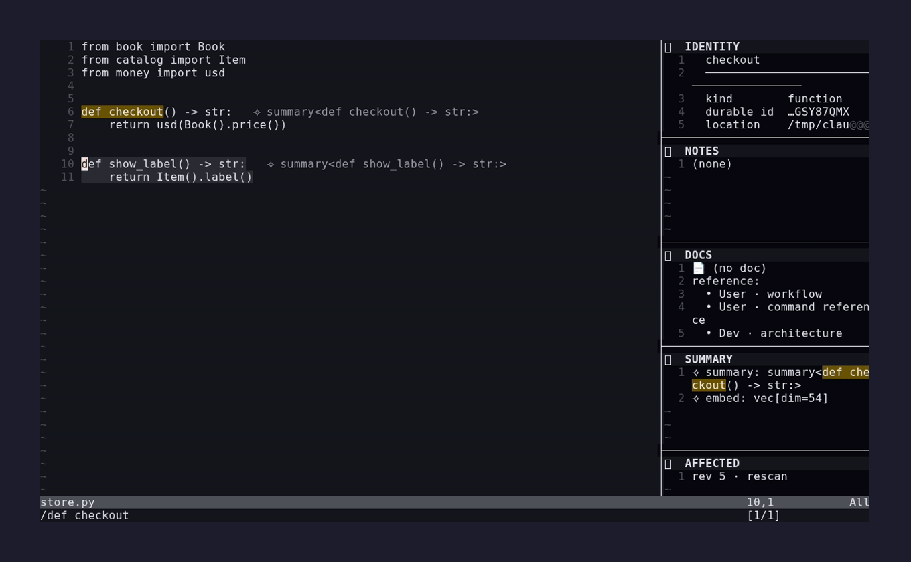

# tyo3.nvim

> Durable, identity-anchored code intelligence inside Neovim — notes and
> summaries that **stay glued to a function through a move and a reformat**, plus
> a live, id-level affected-set as you type. An opinionated, single-path
> distribution: one curated stack, one way through **navigate → observe → act**.
> Powered by the [TyO3](../../README.md) incremental engine via a small daemon.



*Walk the syntax tree, watch the sidebar track the entity under the cursor, open
the action picker on it, and acknowledge a durable `needs_review` flag — all on
one function's durable identity. Regenerate with `devenv shell -- demo-record-hero`.*

*The full ride — the [**showcase tour**](demo/showcase/showcase.gif): kinetic AST
navigation, the action hub, durable identity (a note + doc ride a move across
files), the live affected-set blast radius, and the diagnostics picker + review
acknowledge — the sidebar narrating with every pane lit. Regenerate with
`devenv shell -- demo-record-showcase`.*

*Focused walkthroughs: the [**sidebar tour**](demo/sidebar/sidebar.gif) (the
accordion observe surface), the [**AST-nav tour**](demo/astnav/astnav.gif)
(treewalker motion + textobject select feeding the act path), and the
[**action-hub tour**](demo/codeaction/codeaction.gif) — regenerate with
`devenv shell -- demo-record-sidebar` / `demo-record-astnav` / `demo-record-codeaction`.*

---

## The idea

The compelling editor feature is the one no LSP gives you: **knowledge anchored
to a durable identity that survives edits**. TyO3 assigns every entity a
`DurableId` that outlives renames/moves/reformats, tracks a transitive,
id-level *affected closure* per commit, and carries authored notes + derived
artifacts on that anchor. tyo3.nvim surfaces all of it reactively, around one
loop:

- **Navigate** by structure, not lines — AST motion (treewalker) and textobject
  selections (treesitter) move you between functions, classes, and parameters.
- **Observe** the entity under the cursor in a live accordion sidebar — its
  identity, authored notes, docs, derived summary, and the last edit's affected
  set. **Author a note on a function, move the function to another file — the
  note rides along.** That single moment is the whole pitch.
- **Act** on the resolved entity through one surface — `<leader>c` opens a
  code-action picker offering Author note / Write doc / Move / Explain / Simplify
  / Acknowledge review, entity-gated so an off-entity position offers nothing.
  Everything else (browse entities, the affected set, diagnostics, the sidebar,
  ops) lives one key away in the **hub** (`<leader>t`) — no `:TyO3*` to memorize.

It is **not** another diagnostics source. It is a reactive, per-entity
intelligence layer that rides Neovim's native machinery (`vim.lsp`,
`vim.diagnostic`, code actions) so your existing `K`, `gd`, `grr`, `]d`, and
pickers drive TyO3 for free.

## Architecture

```
  ┌─────────────┐   buffer text (debounced)     ┌──────────────────────┐
  │  Neovim     │ ───── sync_buffer ──────────▶ │  tyo3d (Python)      │
  │  tyo3.nvim  │                               │   owns TyO3Session   │
  │  (Lua)      │ ◀──── delta / refinement ──── │   + overlay + bus    │
  └─────────────┘       (bus push, async)       └──────────────────────┘
   extmarks · sidebar · vim.lsp · snacks picker    unix socket: JSON-RPC 2.0
```

- **`tyo3d`** (ships with the `tyo3` Python package as `tyo3-daemon`) owns one
  `TyO3Session` per project root on a single actor thread, serves JSON-RPC 2.0
  over a per-root unix-domain socket, and pumps the session's delta bus to
  clients as notifications.
- **tyo3.nvim** is a thin client: it spawns/locates the daemon for a buffer's
  project, mirrors buffer text into the session overlay (debounced), and renders
  the results as extmarks, the edgy sidebar, an in-process `vim.lsp` server, and
  snacks pickers.

One daemon + one socket per project root; the plugin routes by the buffer's
root.

## Requirements

- **Neovim 0.12** — the floor for this distribution. The in-process native LSP
  bridge relies on the `vim.lsp` server (`cmd = function`) contract, type-
  hierarchy capability keys, and client-command resolution (`vim.lsp.commands` +
  `client:exec_cmd`) as verified against 0.12; the install path uses the built-in
  `vim.pack` package manager.
- The **curated plugin stack** (below) — snacks.nvim, edgy.nvim,
  tiny-code-action.nvim, treewalker.nvim, and nvim-treesitter (+ textobjects) on
  their `main` branch, plus a **python** treesitter parser. This is a single-path
  distribution: TyO3 owns the setup of these by default (`manage = true`). Opt out
  with `setup{ manage = false }` and own the stack yourself.
- The **`tyo3` Python package** built and importable (`tyo3-daemon` on `PATH`, or
  `python -m tyo3.daemon`). In this repo: `devenv shell -- build`.
- A project with a `.tyo3/config.toml` (or `pyproject.toml`/`.git` to mark the
  root). See [`src/tyo3/demo/tour.py`](../../src/tyo3/demo/tour.py) for an example
  config (precision, layers, generators).

## Install

Neovim 0.12's built-in package manager (`vim.pack`) — declare the curated stack
and tyo3.nvim, then `setup{}`:

```lua
vim.pack.add({
  { src = "https://github.com/folke/snacks.nvim" },
  { src = "https://github.com/folke/edgy.nvim" },
  { src = "https://github.com/rachartier/tiny-code-action.nvim" },
  { src = "https://github.com/aaronik/treewalker.nvim" },
  -- ⚠ nvim-treesitter + textobjects MUST be the `main` branch (the post-rewrite
  -- API this plugin targets — there is no `nvim-treesitter.configs` module).
  { src = "https://github.com/nvim-treesitter/nvim-treesitter", version = "main" },
  { src = "https://github.com/nvim-treesitter/nvim-treesitter-textobjects", version = "main" },
  { src = "https://github.com/your-org/tyo3.nvim" }, -- or a local dir on rtp
})

require("tyo3").setup({})
```

Install the **python** treesitter parser once (`:TSInstall python`, or
`require("nvim-treesitter").install({ "python" })` on the `main` branch). The
exact plugin revisions this release is tested against are pinned in the repo's
[`devenv.nix`](../../devenv.nix) (`tyo3NvimPlugins`); the hermetic CI gate
(`devenv shell -- test-nvim`) provisions that same stack.

If `tyo3-daemon` is not on your `PATH`, point the plugin at the module form:

```lua
require("tyo3").setup({ daemon_cmd = { "python", "-m", "tyo3.daemon" } })
```

To own the stack yourself (no curated plugins configured, no sidebar, no AST
keymaps — TyO3 still attaches its bridge and commands):

```lua
require("tyo3").setup({ manage = false })
```

## Navigate / observe / act

The default keymaps are **buffer-local** and bound only on project `*.py`
buffers (so they don't leak into the rest of your editing). Rebind any leaf in
`keymaps`, set a leaf or sub-table to `false` to opt out.

| Press | Does | Mode |
|---|---|---|
| `<C-k>` / `<C-j>` | **Navigate**: treewalker to prev / next neighbour node | normal, visual |
| `<C-h>` / `<C-l>` | **Navigate**: treewalker out to ancestor / into child | normal, visual |
| `af` / `if` | **Select** a function (outer / inner body) | operator, visual |
| `ac` / `ic` | **Select** a class (outer / inner) | operator, visual |
| `aa` / `ia` | **Select** a parameter (outer / inner) | operator, visual |
| `<leader>c` | **Act**: open the code-action picker on the entity under the cursor/selection | normal |
| `<leader>t` | **Hub**: one picker for every view + op (Entities · Affected · Diagnostics · Authored · Docs · Sidebar · Reindex · Check · Gc) | normal |

Two keys carry every TyO3 interaction: `<leader>c` (**act** on the entity under
the cursor) and `<leader>t` (the **hub** — fuzzy-filter to any view or op instead
of recalling a `:TyO3*` command; the commands still exist). A textobject select
feeds straight into the act path: `vif` then `<leader>c` acts on exactly that
function. The treewalker motion defaults **shadow** the `<C-hjkl>` window-move
keys on project python buffers only; rebind in `keymaps.treewalker` or set it to
`false`.

## The sidebar (observe)

The edgy-managed accordion sidebar on the right edge separates the data hanging
off the entity under your cursor into five vertically stacked, content-driven
views — `IDENTITY` · `NOTES` · `DOCS` · `SUMMARY` · `AFFECTED`. As the cursor
moves, the view with data for the current entity expands and empty views
collapse to title height. `DOCS` shows the entity's authored markdown doc
(durably linked by identity — it rides edits and moves). Toggle from the hub
(`<leader>t` → "Sidebar", or `:TyO3Sidebar`); `:TyO3Inspect` opens it focused on
`IDENTITY`. See the recorded
tour: [`demo/sidebar/sidebar.gif`](demo/sidebar/sidebar.gif).

> edgy is a global window manager: when `manage` is on it sets `laststatus=3` and
> `splitkeep=screen` for the whole editor (required to collapse views to title
> height). That's the opinionated-distribution tradeoff; `manage = false` leaves
> your layout untouched.

## The act surface (`<leader>c`)

`<leader>c` opens the **tiny-code-action** buffer picker over the entity under the
cursor — the single "act on the entity" surface. It reads code actions from the
attached in-process LSP bridge, so the offered actions are **entity-gated**: an
off-entity position offers nothing rather than actions that fail when picked.
Titles name the entity (`tyo3: Explain \`checkout\``) and kinds are split so the
picker icons them distinctly:

- **Author note** / **Write doc** / **Move** — the authoring providers.
- **Explain** (`source.tyo3`) / **Simplify** (`refactor.rewrite`) — the AI
  actions. These appear **only when the project declares the `explain` layer**,
  and the LLM backend is optional (anthropic → any callable → an offline stub).
  Simplify resolves a `WorkspaceEdit` diff preview.
- **Acknowledge review** (`quickfix`, preferred) — when the entity is flagged
  `needs_review`, this re-authors each flagged layer's current value (the
  engine's acknowledge), clearing the WARN.

Because the picker is just LSP code actions, `vim.lsp.buf.code_action()` and any
code-action UI work too; `<leader>c` is the curated entry point.

## The hub (`<leader>t`)

`<leader>c` acts on *one* entity; `<leader>t` is its sibling for everything else —
a single picker that fans out to every project/buffer view and op: **Entities**,
**Affected** set, **Diagnostics**, **Authored** notes, **Docs**, **Sidebar**,
**Reindex**, **Check**, **Gc**. Fuzzy-filter by intent (`aff` → Affected) instead
of recalling a `:TyO3*` command name — the commands all still exist underneath,
and spine plugins add entries with `require("tyo3.hub").register{ … }`. Recorded
tour: [`demo/picker/picker.gif`](demo/picker/picker.gif).

## Native LSP bridge (always on)

The plugin attaches an **in-process** `vim.lsp` server (no extra process, no
socket of its own) on every project python buffer, forwarding a slice of the
daemon's verbs to Neovim's native machinery. The win: tyo3's code intelligence
rides *your* existing config and plugins for free.

| You press / plugin | LSP method | Daemon verb |
|---|---|---|
| `K` (hover) | `textDocument/hover` | `hover` |
| `gd` / `grd` / `<C-]>` (goto-definition) | `textDocument/definition` | `definition` |
| `grr` / references picker (snacks, fzf-lua, Trouble) | `textDocument/references` | `references` |
| document highlight (cursorhold) | `textDocument/documentHighlight` | `document_highlights` |
| document symbols / `:lua vim.lsp.buf.document_symbol()` | `textDocument/documentSymbol` | `decorate` |
| workspace symbols (`grs` / pickers) | `workspace/symbol` | `symbols` |
| call hierarchy (incoming / outgoing) | `textDocument/prepareCallHierarchy` + `callHierarchy/*Calls` | `call_hierarchy` |
| type hierarchy (super / sub) | `prepareTypeHierarchy` + `typeHierarchy/supertypes`·`subtypes` | `type_hierarchy` |
| `grn` (rename) | `textDocument/prepareRename` + `textDocument/rename` | `can_rename` + `rename` |
| `]d` / `[d`, `vim.diagnostic`, Trouble, lualine | `textDocument/diagnostic` (pull) **and** `publishDiagnostics` (push, on bus deltas) | `check` |
| `<leader>c` / tiny-code-action / `vim.lsp.buf.code_action()` | `textDocument/codeAction` → client commands `tyo3.*` | `entity_at`, `explain`, `author`, … |

Beyond LSP, the bridge publishes spine **layer state** — the durable-identity
concepts that have no LSP vocabulary — into a dedicated `vim.diagnostic`
namespace (`tyo3-layer`), so `]d` / `[d` / `setqflist` / Trouble / lualine
navigate `needs_review` (WARN) and `orphaned` (HINT) entities for free. It's
driven by the daemon's `review_state` verb and refreshed off the bus.

Both streams ride `vim.diagnostic`, so they coexist on one buffer. With
`manage = true`, `setup{}` configures `vim.diagnostic` to match the rest of the
UI — a rounded float on `]d`/`[d` jumps (like the hover/explain floats) and
severity-sorted signs — and the hub's **Diagnostics** entry (`<leader>t`, or
`:TyO3Diagnostics`) opens a snacks picker listing *all* of a buffer's diagnostics
(type errors **and** durable layer state) in one bordered, searchable list. `manage = false` leaves your own `vim.diagnostic.config`
untouched.

`needs_review` is **durable level state**: a note on a `review_on_change` layer
flags when the entity's body differs from the body as it was when the note was
authored (the engine stamps that hash at author time). So the WARN survives a
save, survives editing a *different* function in the same file, survives an
editor restart, **clears when you revert the body** to the reviewed bytes, and
**clears when you re-author the note** (the "I reviewed this" acknowledge — the
`gra` quickfix above). This is distinct from the per-commit *edge* signal on the
bus delta, which the plugin only uses as a refresh trigger.

The server advertises `positionEncoding = "utf-32"` (the daemon's columns are
Unicode codepoints) and only the capabilities it implements. One server is shared
per project root (`vim.lsp.start` dedupes by `{name, root_dir}`). Buffer text is
synced to the daemon by the plugin's own `BufEnter` / debounced `TextChanged`
path, so the LSP `did*` notifications are no-ops; a request issued inside the
debounce window can read slightly stale state until the next sync.

## Configuration

`setup{}` accepts (defaults shown):

| Option | Default | Meaning |
|---|---|---|
| `manage` | `true` | TyO3 owns the curated stack (snacks/edgy/tiny-code-action/treesitter/treewalker) + the sidebar + the AST keymaps. `false` ⇒ you own the stack; the bridge and commands still work. |
| `keymaps` | *(see below)* | Buffer-local navigate/observe/act keymaps. Per-leaf string to rebind, leaf or sub-table `false` to opt out. |
| `debounce_ms` | `300` | Pause before a `TextChanged` commit fires. One commit per pause. |
| `precision` | `"method"` | Hint surfaced in `:checkhealth` (the daemon owns the real setting via `.tyo3/config.toml`). |
| `virtual_text` | `true` | Render notes + summaries inline as virtual text. |
| `context_debounce_ms` | `100` | Pause before the cursor-context (sidebar) lookup fires. Kept snappy so the sidebar tracks AST motion. |
| `request_timeout_ms` | `20000` | Per-request daemon RPC timeout; a stalled request errors its callback instead of hanging the UI. `0` disables. |
| `daemon_cmd` | `nil` | Launch command. `nil` ⇒ auto-detect `tyo3-daemon`, else `python -m tyo3.daemon`. |
| `root_markers` | `{".tyo3","pyproject.toml",".git"}` | Upward search for the project root. |
| `overseer` | `false` | Enable the optional overseer.nvim ops integration. |
| `log_level` | `"info"` | Notify level floor: `debug`/`info`/`warn`/`error`. |

`keymaps` defaults:

```lua
keymaps = {
  code_action = "<leader>c",  -- act on the entity under the cursor
  hub         = "<leader>t",  -- the hub: views + ops (false to opt out)
  textobjects = {
    function_outer = "af",  function_inner = "if",
    class_outer    = "ac",  class_inner    = "ic",
    parameter_outer= "aa",  parameter_inner= "ia",
  },
  treewalker = { up = "<C-k>", down = "<C-j>", parent = "<C-h>", child = "<C-l>" },
}
```

> The AI actions (Explain / Simplify) are **project-config-driven**, not a client
> flag: they appear only when the project declares the `explain` layer in
> `.tyo3/config.toml`, and the LLM backend stays optional. There is no `ai`/`lsp`
> toggle — the bridge is always on; declare the layer to enable the AI actions.

## Commands

Every interaction is reachable from the keyboard without the cmdline — `<leader>c`
(act) and `<leader>t` (the hub). These commands are the named equivalents: the
hub calls them, and they stay available for scripting and discovery.

| Command | Does |
|---|---|
| `:TyO3Hub` | Open the hub — one fuzzy-filtered picker for every view + op below (same as `<leader>t`). |
| `:TyO3Sidebar` | Toggle the edgy accordion sidebar. |
| `:TyO3Inspect` | Open the sidebar focused on the IDENTITY view for the entity under the cursor. |
| `:TyO3Note [text]` | Author an intent note on the entity under the cursor (prompts if no text). |
| `:TyO3Doc` | Write/edit a markdown doc for the entity under the cursor — glued to its identity. |
| `:TyO3Docs` | Open the documentation (user guides + developer/architecture). |
| `:TyO3Move <name> <dest>` | Atomically move an entity to another file — id + note + doc + hash preserved. |
| `:TyO3Affected` | Picker over the last edit's affected set; jump by identity. |
| `:TyO3Entities` | Picker over all known entities. |
| `:TyO3Authored` | Picker over entities carrying an authored note. |
| `:TyO3Diagnostics` | snacks picker over this buffer's diagnostics — LSP type errors **and** the durable layer state (`needs_review`/`orphaned`) in one list. |
| `:TyO3Diff <from_rev> [to_rev]` | Entity-level snapshot diff (added/removed/changed/moved). |
| `:TyO3Start` / `:TyO3Stop` | Attach the daemon for this buffer / stop all session daemons. |
| `:TyO3Reindex` / `:TyO3Gc` / `:TyO3Check` | One-shot daemon ops (rescan / gc orphans / type-check). |
| `:TyO3DaemonLog` | Show the captured daemon stderr log. |

## Documentation

- User: [workflow](docs/user/workflow.md) · [command reference](docs/user/commands.md)
- Developer: [architecture](docs/dev/architecture.md) · [durable identity](docs/dev/identity.md)

## Health

```
:checkhealth tyo3
```

Reports daemon-command resolution, any **missing curated dependency** (a hard
error under the single-path model — no silent degrade), and, from inside a
project buffer, pings the running daemon for liveness + engine version + the
available RPC methods.

## Protocol (as built)

Newline-delimited **JSON-RPC 2.0** over a per-root unix socket
(`$XDG_RUNTIME_DIR/tyo3/<hash>.sock`). Positions on the wire are **1-based**
(TyO3 native convention); the plugin converts from Neovim's 0-based columns.

**Requests** (editor → daemon):

| Method | Params | Result |
|---|---|---|
| `ping` | `{}` | `{ok, engine_version, revision, methods, …}` |
| `open` | `{root}` | `{session_id, revision, files, layers, precision}` |
| `sync_buffer` | `{path, text}` | `CommitDelta` `{revision, changed_ids, affected_ids, moved, touched_files, …}` |
| `sync_buffers` | `{edits:{path:text}}` | `CommitDelta` (one atomic commit — the move path) |
| `entity_at` | `{path, line, col}` | entity card or `null` |
| `decorate` | `{path}` | `[{durable_id, name, qualified_name, kind, range, note?, summary?}]` |
| `author` | `{layer, durable_id, value}` | `{revision}` |
| `authored` | `{layer, durable_id}` | `{value, status, revision}` |
| `locate` | `{durable_id}` | `{location}` (`file::qualified_name`) |
| `diff` | `{from_rev, to_rev?}` | `{added, removed, changed, moved, …}` |
| `derived` | `{layer, durable_id}` | `{status, artifact, revision}` |
| `layers` | `{}` | `{layers:[{name, origin, entity_kinds, review_on_change, serving, display, schema?, …}]}` |
| `layer_ids` | `{layer, with_values?}` | `{layer, ids, values?}` — the ids with a record in `layer` |
| `diagnostics_at` | `{path, line, col}` | `{diagnostics:[…], count}` — `check` diagnostics whose range contains the position |
| `context_pack` | `{path, line, col, mode?}` | LLM context or `null` (pure read — the substrate `explain` runs over) |
| `explain` | `{path, line, col, mode?}` | `{durable_id, text, mode}` or `null` — runs the LLM seam, stores the result on the `explain` layer |
| `reindex` / `gc` / `check` | `{}` | op result |
| `references` / `definition` / `document_highlights` | `{path, line, col}` | navigation targets (absolute paths) |
| `hover` / `type_hierarchy` / `call_hierarchy` / `can_rename` / `rename` | `{path, line, col, …}` | analysis result or `null` |
| `symbols` | `{query?}` | `{symbols:[…]}` — project-wide symbol list (workspace-symbol surface) |
| `simplify_edit` | `{path, line, col}` | `WorkspaceEdit` diff for the Simplify code action (`codeAction/resolve`) |
| `review_state` | `{path?}` | `{items:[{durable_id, name, path, range, state}]}` — `needs_review` / `orphaned` joined with node ranges |
| `subscribe` | `{files?, ids?, layers?, all?}` | `{ok}` — sets this connection's bus-notification interest |

**Notifications** (daemon → editor, from the bus pump):

| Method | Params |
|---|---|
| `delta` | `{revision, changed_ids, affected_ids, moved_ids, touched_files, rescan, …}` |
| `derived` | `{revision, layer, durable_id}` — a `serving="stale"` value the off-actor worker just made fresh; re-pull it (idempotent) |
| `refinement` | `{revision, narrowed, added}` (only with `precision = "method"`) |

## Development & tests

- The verifiable core is the **daemon pytest** (handlers + a full socket
  end-to-end): `devenv shell -- pytest src/tyo3/daemon/tests -q --no-cov`.
- The **Lua spec suite** runs headless against a real daemon + the hermetically
  provisioned curated stack:

  ```
  devenv shell -- test-nvim
  ```

  It provisions the six plugins + python grammar from Nix (`TYO3_NVIM_DEPS`),
  runs every spec — engine specs (dep-free) and the UI specs (sidebar / AST nav,
  no longer skipped) — and exits non-zero on any failure. It's folded into
  `test-ci`. A dev with no curated stack still gets the dep-light engine sweep
  green (the UI specs skip cleanly).

## License

Same as the parent TyO3 project.
</content>
